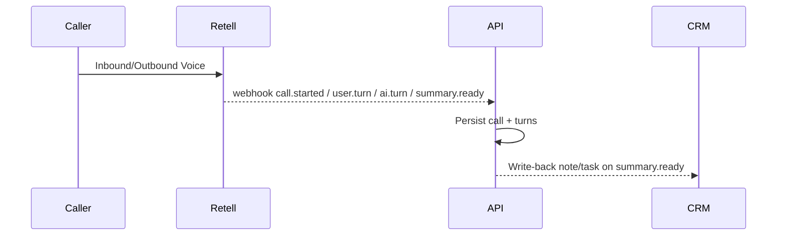
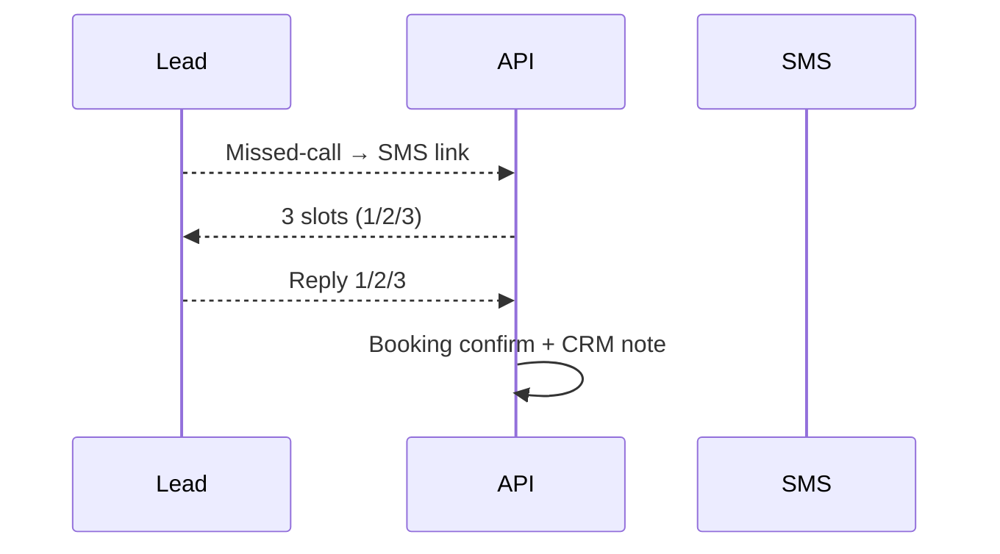
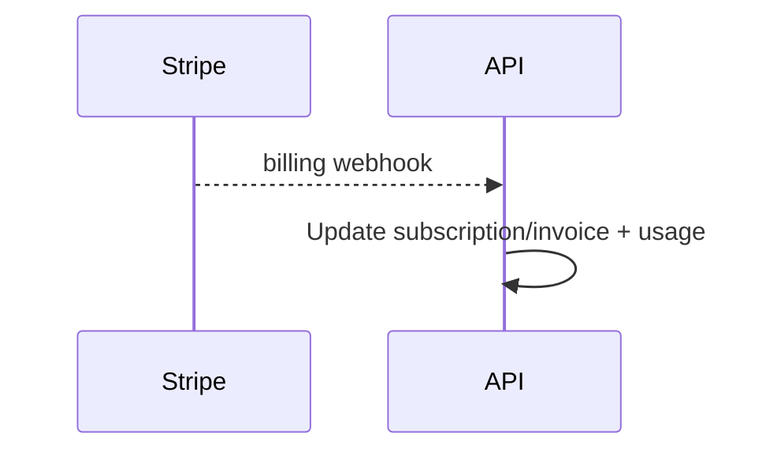

# Architecture

```mermaid
sequenceDiagram
  participant Caller
  participant Retell
  participant API
  participant CRM
  Caller->>Retell: Inbound/Outbound Voice
  Retell-->>API: webhook call.started / user.turn / ai.turn / summary.ready
  API->>API: Persist call + turns
  API-->>CRM: Write-back note/task on summary.ready
```

```mermaid
sequenceDiagram
  participant Lead
  participant API
  participant SMS
  Lead-->>API: Missed-call → SMS link
  API-->>Lead: 3 slots (1/2/3)
  Lead-->>API: Reply 1/2/3
  API->>API: Booking confirm + CRM note
```

```mermaid
sequenceDiagram
  participant Stripe
  participant API
  Stripe-->>API: billing webhook
  API->>API: Update subscription/invoice + usage
```

